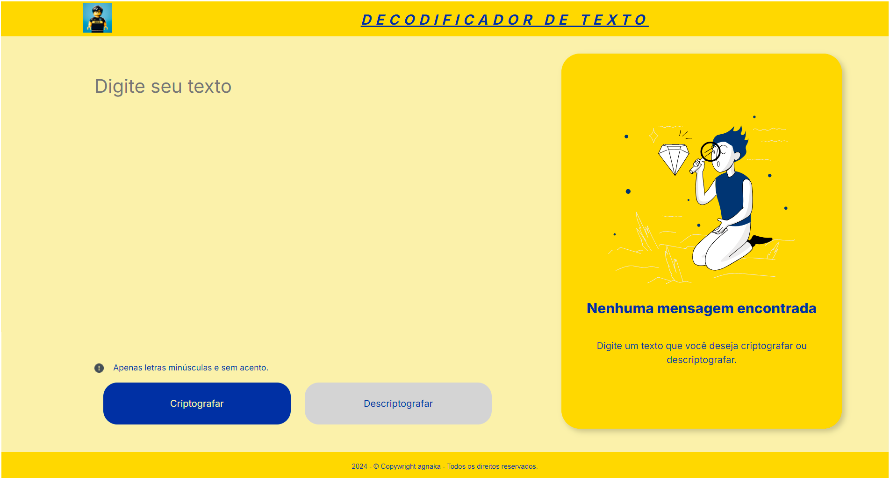
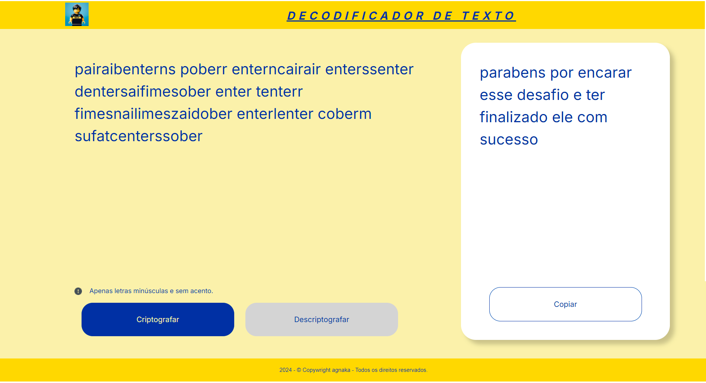

<h1>DECODIFICADOR DE TEXTOS</H1>

 Página inicial  

 Página Criptografada/Descriptografada

<h2>Projeto</h2>

Este projeto é um desafio do programa da Oracle One, da formação "Iniciantes em Programação". Consistente em aplicar todo o aprendido em HTML, CSS e JavaScript, do inicio ao fim, sem nehuma base do HTML. O site também foi executado para ser responsivo, usando as médias queries

<h2>Descrição de uso</h2>

O usuário deve inserir um texto, no campo específico "Digite seu texto" e clicar no botão respectivo para criptografar ou descriptografar, e o resultado aparece onde tem o texto "Nenhuma mensagem encontrada", pudendo copiar com seu respectivo botão.
Somente aceita letras minúsculas e espaços.

<h2>Tecnologias</h2>

    
    
    

<h2>Autor</h2>

 Andrés Nakagawa